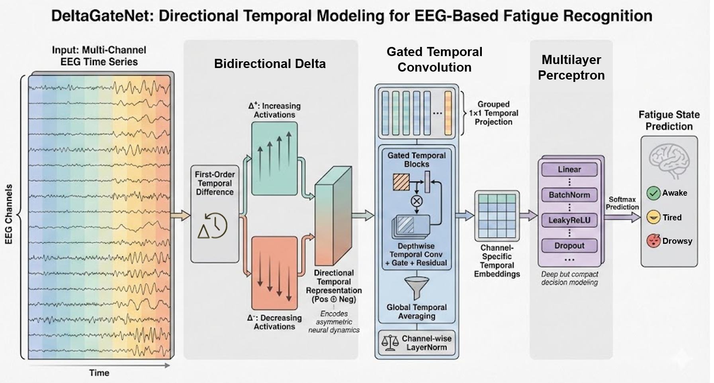

# DeltaGateNet

**Bidirectional Temporal Dynamics Modeling for EEG-based Driving Fatigue Recognition**

[arXiv:2602.14071](https://arxiv.org/abs/2602.14071)

## Overview

<div align="center">



*Architecture of DeltaGateNet*

</div>

Driving fatigue is a major contributor to traffic accidents. Electroencephalography (EEG) provides a direct measurement of neural activity, yet EEG-based fatigue recognition is hindered by strong non-stationarity and asymmetric neural dynamics. **DeltaGateNet** captures bidirectional temporal dynamics with a Bidirectional Delta module that decomposes first-order differences into positive and negative components, then models long-term, channel-specific dependencies with gated temporal convolution.

On [SEED-VIG](https://bcmi.sjtu.edu.cn/home/seed/seed-vig.html), DeltaGateNet reaches **81.89%** intra-subject and **55.55%** inter-subject accuracy. On balanced SADT 2022 it reaches **96.81%** / **83.21%**, and on unbalanced SADT 2952 **96.84%** / **84.49%**.

The model is dataset-agnostic: set `--num_channels` and `--num_classes` from the training entry point. Remaining architecture and training hyperparameters are hardcoded to the paper/notebook values.

## Installation & Setup

### Environment Setup

> [!TIP]
> Local users: all packages are listed in `./environment.yml`. Colab users can install from `./requirements.txt`.

```bash
# Create environment
conda env create -f environment.yml
# Activate environment
conda activate deltagatenet
```

```bash
# Additionally, removal of environment
conda env remove -n deltagatenet
```

Or from the repository root:

```bash
bash run_script/setup.sh
conda activate deltagatenet
```

## Data Preparation

Download the official releases and place them under `./datasets` from the repository root.

#### 1. SEED-VIG

Apply and download from the BCMI site:

> SEED-VIG: [https://bcmi.sjtu.edu.cn/home/seed/seed-vig.html](https://bcmi.sjtu.edu.cn/home/seed/seed-vig.html)

> [!IMPORTANT]
> You need the **raw EEG** and **PERCLOS label** folders. After extracting the official archive, copy:
>
> - `Raw_Data/` — one `.mat` session file per recording
> - `perclos_labels/` — matching `.mat` files with the `perclos` field
>
> Do not flatten these two folders. Default model knobs: `--num_channels 17 --num_classes 3`.

#### 2. SADT (balanced, 2022 samples)

Download the Cui et al. processed release (extracted from Cao et al., *Scientific Data*, 2019):

> SADT balanced: [https://figshare.com/articles/dataset/EEG_driver_drowsiness_dataset/14273687?file=30707285](https://figshare.com/articles/dataset/EEG_driver_drowsiness_dataset/14273687?file=30707285)

#### 3. SADT (unbalanced, 2952 samples)

> SADT unbalanced: [https://figshare.com/articles/dataset/EEG_driver_drowsiness_dataset_unbalanced_/16586957?file=30706676](https://figshare.com/articles/dataset/EEG_driver_drowsiness_dataset_unbalanced_/16586957?file=30706676)

> [!IMPORTANT]
> Keep the Figshare `.mat` variables **`EEGsample`**, **`subindex`**, and **`substate`**. Place the file in `datasets/SADT-2022/` or `datasets/SADT-2952/` (any `*.mat` name is fine). Default model knobs: `--num_channels 30 --num_classes 2`.
>
> If you use this processed SADT data, please also credit Cao et al. (original recordings) and Cui et al. (alert/drowsy extraction).

Please place files under the following tree:

```bash
DeltaGateNet
└── datasets
    ├── SEED-VIG
    │    ├── Raw_Data
    │    └── perclos_labels
    ├── SADT-2022
    │    └── *.mat
    └── SADT-2952
         └── *.mat
```

## Training

> [!TIP]
> Please run from the project's root directory (i.e. `DeltaGateNet/`).

The only model knobs exposed from `main` are `--num_channels` and `--num_classes`. Also set `--dataset`, `--data_dir`, and `--mode` (`intra` or `inter`).

### Local

#### SEED-VIG

> Configure `./run_script/run_seedvig.sh` (`DATA_DIR`, `NUM_CHANNELS`, `NUM_CLASSES`, `MODE`) \
> Run `./run_script/run_seedvig.sh`

```bash
python -m train.train \
    --dataset seed-vig \
    --data_dir ./datasets/SEED-VIG \
    --num_channels 17 \
    --num_classes 3 \
    --mode intra
```

#### SADT

> Configure `./run_script/run_sadt.sh` \
> Set `DATA_DIR=./datasets/SADT-2022` or `./datasets/SADT-2952` \
> Run `./run_script/run_sadt.sh`

```bash
python -m train.train \
    --dataset sadt \
    --data_dir ./datasets/SADT-2022 \
    --num_channels 30 \
    --num_classes 2 \
    --mode intra
```

On Windows, run the same commands in Git Bash or WSL.

> [!TIP]
> Fold checkpoints and plots are written to `./logs/<dataset>/<mode>/fold_<n>/`.

### Google Colab

1. Upload this repository to Drive (keep the folder layout).
2. Put `datasets/` on Drive using the tree above, or point `DATA_DIR` at an existing copy.
3. Open [`notebooks/DeltaGateNet_Colab.ipynb`](notebooks/DeltaGateNet_Colab.ipynb), set `REPO_DIR` / `DATA_DIR`, and run all cells.

The notebook mounts Drive, installs `requirements.txt`, and calls `run_script/run_colab.sh`.

```bash
# Equivalent Colab command after `cd` into the repo
DATASET=seed-vig \
DATA_DIR="/content/drive/My Drive/Driving Fatigue Project/Data/SEED-VIG" \
NUM_CHANNELS=17 NUM_CLASSES=3 MODE=intra \
bash run_script/run_colab.sh
```

## Citation

If you use this code or the model, please cite:

```bibtex
@article{yip2026bidirectional,
  title={Bidirectional Temporal Dynamics Modeling for EEG-based Driving Fatigue Recognition},
  author={Yip Tin Po and Jianming Wang and Yutao Miao and Jiayan Zhang and Yunxu Zhao and Xiaomin Ouyang and Zhihong Li and Nevin L. Zhang},
  journal={arXiv preprint arXiv:2602.14071},
  year={2026},
  url={https://arxiv.org/abs/2602.14071}
}
```
